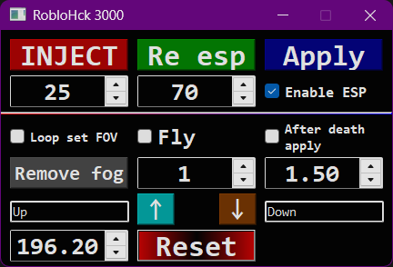

# Is this detected?
I think <mark>yes🙁</mark>
# How frequetly it updated?
In my plans <mark>its updating by itself</mark> because it fetches offsets from some api that works
# WTF is this?
This is shitty homemade external/exploit that <mark>you can run everywhere</mark>
# How to use?
1. Launch Roblox app
2. Teleport into any game
3. Click inject in external
4. Change speed, jump power, FOV and ESP tick, then click apply(can crash roblox if you change speed, jump power or ESP tick too many times)
5. You can set loop fov set if game resets fov(roblox doesnt crash if you set FOV too many times)
6. After death tick applies automatically settings like speed, jump power, FOV and ESP tick, after you respawn(can crash roblox)
# How this is works?
1. Getting fake datamodel from pointer
2. From fake datamodel it gets real datamodel
3. From datamodel it gets workspace
4. From workspace it gets camera
5. From camera it gets humanoid
6. Now it has addresses for speed, jump power, FOV, etc for writing
# Preview:

~~Un~~detected
***
[Quazonish](https://github.com/Quazonish/)